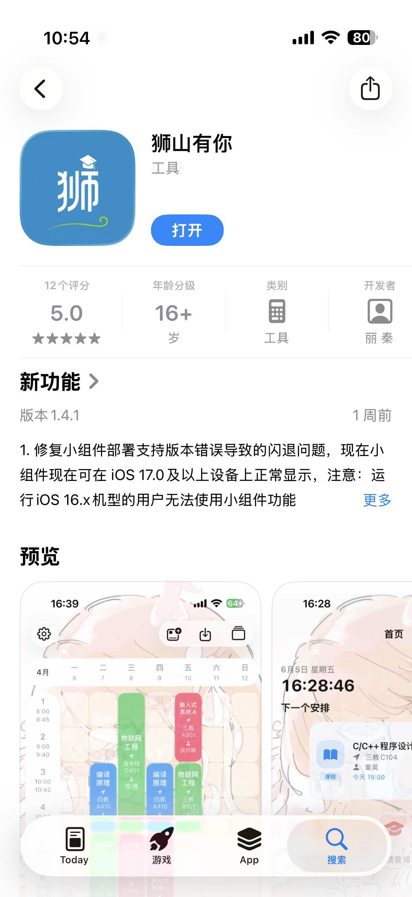
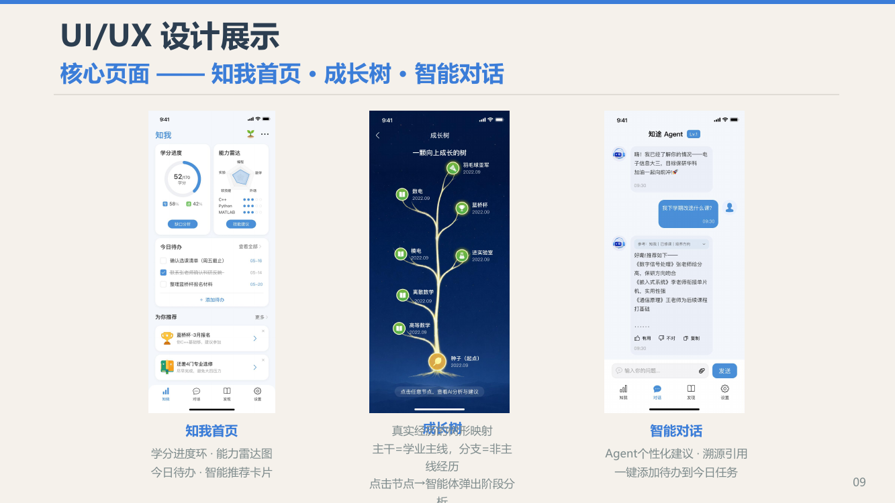
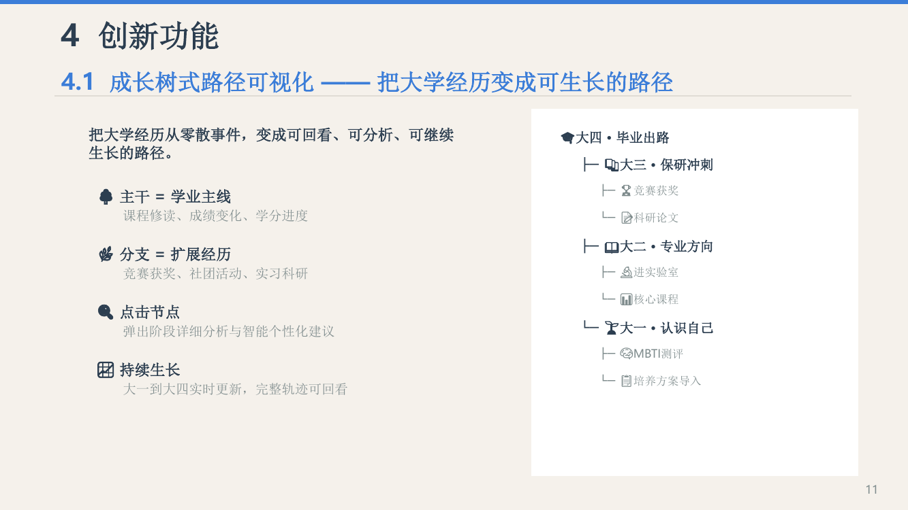
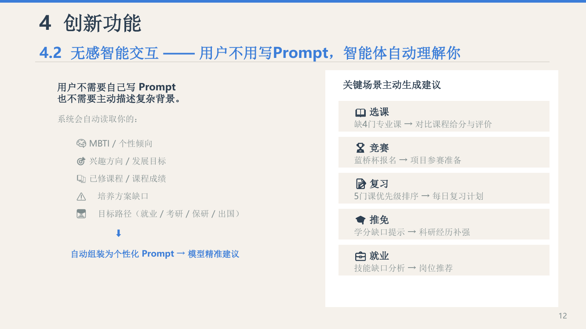

# 狮山有你 iOS

华中农业大学校园服务 App。项目把课程、成绩、考试和校园生活信息集中到一个入口，帮助同学在日常学习和生活中少切换几个系统、少重复查几次资料。

狮山有你已经在 App Store 正式上架；[点击查看 App Store 页面](https://apps.apple.com/cn/app/%E7%8B%AE%E5%B1%B1%E6%9C%89%E4%BD%A0/id6760356908)。本仓库保留 iOS 客户端工程和主要功能实现，适合了解一个真实校园 App 如何从需求、交互到发布落地。

| 代码 | 产品页面 | 产品演进 |
|---|---|---|
| [Shishanyouni_iOS](https://github.com/douerlucky/Shishanyouni_iOS) | [App Store](https://apps.apple.com/cn/app/%E7%8B%AE%E5%B1%B1%E6%9C%89%E4%BD%A0/id6760356908) | [知途 CampusPath](https://github.com/douerlucky/campusPath) |

## 项目定位

校园信息往往分散在教务系统、校园网页和不同的生活服务入口中。狮山有你先解决最常用、最具体的校园信息获取问题：今天上什么课、考试在哪里、哪间教室空着、宿舍还剩多少电，以及校园里有哪些值得使用的服务。

它的重点不是堆叠功能，而是把“查到信息”变成可以直接使用的校园体验：游客可以先浏览公开内容，登录后再访问个人课表、成绩和考试等服务；重要事项还可以加入系统日历或通过桌面小组件查看。

## 核心体验

| 场景 | 代表功能 | 解决的问题 |
|---|---|---|
| 学习安排 | 课表、成绩、考试、全校课程 | 不必在多个教务入口之间来回切换 |
| 校园生活 | 空教室、图书馆座位、校车、校园地图、校历、攻略、社团 | 到校后能快速找到信息和服务 |
| 个人效率 | 桌面课表小组件、日历事件、宿舍电费提醒 | 把一次查询变成持续可见的提醒 |
| 运动与健康 | 环湖跑、体测成绩、体测计算器 | 集中查看运动记录和体测相关信息 |

## 已上线产品展示



上图为 App Store 公开页面截图，展示了正式上架的产品信息和实际预览图。登录、校园账号和个性化数据需要在真实校园环境中使用，仓库不会包含任何个人账号、密码或服务端密钥。

## 从狮山有你走向知途 CampusPath

狮山有你和知途 CampusPath 是同一条产品线的两个阶段：

- **狮山有你**：当前已经落地的校园服务入口，重点是把分散的校园信息查出来、用起来。
- **知途 CampusPath**：在已有校园数据和服务基础上的下一阶段目标，重点是把课程、经历、能力和计划组织成一条可以持续更新的成长路径。

知途不是把狮山有你重新做一遍，也不代表狮山有你当前已经完整具备设计稿里的全部能力。它要回答的是更长线的问题：学生已经修过什么、还缺什么、下一步适合做什么，以及这些经历如何逐步形成自己的方向。

下面的图片来自知途 CampusPath 的作品材料，用来说明产品演进方向，不代表狮山有你当前版本的线上界面。

| 知途方向 | 说明 |
|---|---|
| 知我首页 | 汇总学分进度、能力信息和今日待办 |
| 成长树 | 把课程主线和竞赛、科研等经历组织成可回看的路径 |
| 智能对话 | 基于个人档案和校园上下文给出建议，并把建议转成待办 |







完整的 CampusPath 代码和作品说明见 [campusPath 仓库](https://github.com/douerlucky/campusPath)。

## 项目成果

- 狮山有你 iOS 版已在 App Store 正式上架。
- 支持游客模式、校园信息聚合、个人课程服务、桌面小组件和系统日历联动。
- 项目由华中农业大学沸点工作室移动 App 开发组持续维护。

## 代码与构建

- 语言和界面：Swift、SwiftUI；部分系统能力使用 UIKit 桥接。
- 主要系统能力：WidgetKit、EventKit、WebKit、BackgroundTasks、Security。
- 工程入口：`shishanyouni.xcodeproj`。
- 建议使用 Xcode 打开工程，在真机或模拟器中选择 `shishanyouni` scheme 构建。

登录和校园服务依赖学校系统及项目服务端环境，公开仓库只提供客户端代码与可公开的工程资源；不要把个人账号、Cookie、Token 或私有接口配置提交到仓库。

## 目录速览

```text
shishanyouni/          主 App
ScheduleWidget/        课表桌面小组件
shishanyouniTests/     单元测试
shishanyouniUITests/   UI 测试
SwiftyRSA_Src/         RSA 相关源码
docs/images/           项目展示图片
```

## 说明

App Store 页面中的功能和版本会随发布迭代变化；README 只描述产品方向和仓库中已经公开的能力，不把 CampusPath 的规划功能写成狮山有你当前版本的承诺。
